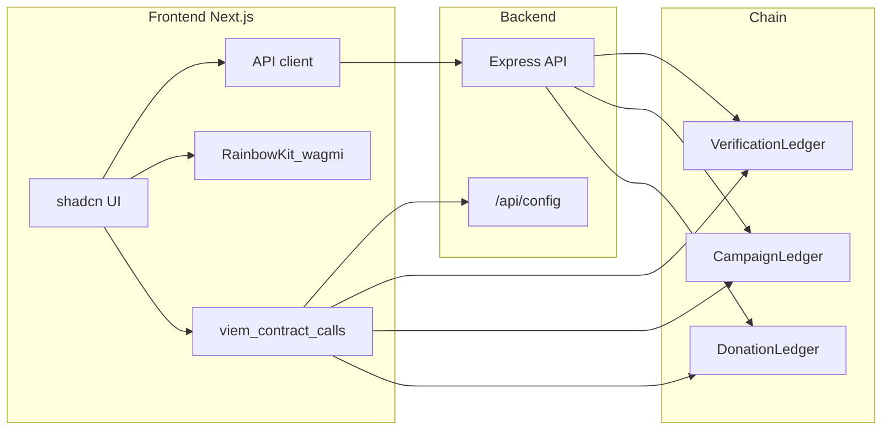

# CivicTrust Frontend Plan

## Context

- **Backend**: Node API at `http://localhost:3001` with read endpoints and `GET /api/config` (contract addresses + ABIs). User-facing writes (register NGO, create campaign, record donation) are done by the frontend using the user’s connected wallet and the config from the API.
- **Roles**: **Public** (browse only), **NGO** (register, create/deactivate campaigns), **Donor** (record donations), **Admin** (verify/reject NGOs, list all NGOs).
- **No frontend exists yet**; only [Backend/package.json](D:\projects\CivicTrust\Backend\package.json) is present at repo root.

---

## Recommended stack

| Layer      | Choice                                                   | Why                                                         |
| ---------- | -------------------------------------------------------- | ----------------------------------------------------------- |
| Framework  | **React 18 + Vite**                                      | Fast dev experience, simple SPA; you specified React + Vite |
| Styling    | **Tailwind CSS**                                         | Required by shadcn/ui                                       |
| Components | **shadcn/ui**                                            | Consistent, accessible, customizable                        |
| Routing    | **React Router v6**                                      | Client-side routes for /ngos, /campaigns, /dashboard, etc.  |
| Wallet     | **RainbowKit + wagmi + viem**                            | Simple connect UX, chain support, works with existing ABIs  |
| Data       | **Fetch to Backend API** + **viem contracts** for writes | Reads via REST; writes via wallet + `/api/config`           |

---

## High-level architecture



- **Reads**: UI → API client → Backend REST → contracts (backend uses RPC).
- **Writes**: UI → fetch `/api/config` → viem + connected wallet → sign tx → chain.

---

## Project structure (suggested)

```
Frontend/                     (React + Vite at repo root or in Frontend/)
├── index.html
├── vite.config.ts
├── src/
│   ├── main.tsx
│   ├── App.tsx               # React Router, wallet provider wrapper
│   ├── App.css
│   ├── index.css             # Tailwind entry
│   ├── pages/
│   │   ├── HomePage.tsx       # Landing
│   │   ├── NgosPage.tsx       # List verified NGOs
│   │   ├── NgoDetailPage.tsx  # NGO detail + campaigns
│   │   ├── CampaignsPage.tsx  # All active campaigns
│   │   ├── CampaignDetailPage.tsx  # Campaign detail + donate CTA
│   │   ├── DonatePage.tsx     # Record donation (campaignId from route)
│   │   ├── DashboardPage.tsx  # Role-based: NGO or Donor or Admin
│   │   └── AdminPage.tsx      # List NGOs, verify/reject
│   ├── components/
│   │   ├── ui/                # shadcn components
│   │   ├── layout/            # Header, Footer, Nav
│   │   ├── wallet/            # ConnectButton, chain switcher
│   │   └── shared/            # Loading, EmptyState, ErrorMessage
│   ├── lib/
│   │   ├── api.ts             # Base URL, fetch wrappers for Backend
│   │   ├── contracts.ts       # Load config, create viem read/write contracts
│   │   └── role.ts            # isAdmin(address), getNgoByWallet(address) via API
│   └── hooks/
│       └── useContractConfig.ts  # GET /api/config, memoized
├── .env
│   VITE_API_URL=http://localhost:3001
└── package.json
```

---

## UI design

### Design direction

- **Vibe**: Trust, transparency, clarity. CivicTrust is about verified NGOs and traceable donations; the UI should feel professional and calm, not playful or noisy.
- **Tone**: Clear headings, short copy, obvious primary actions (Donate, Register NGO, Verify).

### Design tokens (Tailwind / CSS variables)

- **Primary**: One strong primary color for CTAs (e.g. blue or teal) and a subtle success green for verified badges and success states.
- **Neutrals**: Light gray background for cards/sections, white or off-white for main surface; dark text for readability.
- **Typography**: Clean sans-serif (Inter or similar); clear hierarchy: one H1 per page, consistent H2 for sections, body for content.
- **Spacing**: Generous padding on cards and sections; consistent gap in grids (e.g. 4–6 for cards grid).
- **Borders**: Subtle borders or soft shadows for cards; verified badge and status pills (Verified / Pending / Active / Ended) with distinct but muted colors.

### Key screen layouts (wireframe-style)

**1. Landing**

- Sticky header: Logo (CivicTrust), nav links (NGOs, Campaigns), Connect wallet (right).
- Hero: Headline (e.g. “Transparent giving. Verified NGOs.”), short subtext, two CTAs: “Browse NGOs”, “Browse campaigns”.
- Section: “How it works” (3 steps: Browse → Connect wallet → Donate or Register).
- Footer: Links, chain badge if needed.

**2. NGOs list**

- Page title: “Verified NGOs”. Optional filter/tab: All / Verified only.
- Grid or list of cards: NGO name, short tagline/description if available, “Verified” badge, CTA “View campaigns”.
- Empty state: “No NGOs yet” or “No verified NGOs” with link to register.

**3. NGO detail**

- Breadcrumb or back: NGOs > [NGO name].
- Card: NGO name, registration info (if shown), verified badge, wallet (truncated).
- Section: “Campaigns” – list of campaign cards (title, description snippet, end date, “Active”/“Ended”, “View” / “Donate”).

**4. Campaigns list**

- Page title: “Active campaigns”. Optional: filter by NGO.
- Grid of campaign cards: NGO name, campaign title, description snippet, end date, “Donate” primary button.

**5. Campaign detail**

- Breadcrumb: Campaigns > [Campaign title].
- Hero card: Title, description, NGO name (link), dates, status (Active/Ended).
- “Donate” CTA (disabled if ended).
- Section: “Donation transparency” – list of donation records (donation id, amount, donor truncated, date) from API.

**6. Donate page**

- Title: “Record your donation” for [Campaign title].
- Form: Amount (input + unit, e.g. INR or wei), Transaction reference (text, for UPI/bank ref).
- Note: “You will sign a transaction with your wallet to record this on-chain.”
- Buttons: “Back to campaign”, “Record donation” (primary, opens wallet).

**7. Dashboard (role-based)**

- Header: “Dashboard” + role badge (Donor / NGO: [name] / Admin).
- **Donor**: Short message + “Browse campaigns to donate”.
- **NGO (unverified)**: “Your registration is pending verification.” + link to support or wait.
- **NGO (verified)**: “Create campaign” button, then list “My campaigns” with edit/deactivate where applicable.
- **Admin**: Link to “Admin panel” or inline list of NGOs with Verify/Reject.

**8. Admin**

- Page title: “Admin – NGO verification”.
- Table or card list: NGO name, registration number, wallet (truncated), status (Pending/Verified), actions: “Verify” / “Reject”.
- Optional: “Transfer admin” section (address input + button).

### Components to align with design

- Use **shadcn/ui** Button, Card, Input, Label, Table, Badge, Toast (Sonner), Skeleton for loading.
- Custom: **VerifiedBadge**, **CampaignCard**, **NgoCard**, **RoleBadge** (Donor/NGO/Admin), **DonationRow** (for transparency table).
- Layout: **Header** (logo, nav, Connect wallet), **Footer** (minimal), **PageContainer** (max-width + padding for content).

---

## Core user flows

1. **Landing (public)**
   Hero, “Browse NGOs” / “Browse campaigns”, “Connect wallet to register or donate”. No wallet required.
2. **Browse**

- NGOs: `GET /api/ngo/list` or by count + paginate by id; show verified only or filter.
- Campaigns: `GET /api/campaigns/count`, fetch by id or by `GET /api/campaigns/ngo/:ngoId` and aggregate; show active only.
- Campaign detail: `GET /api/campaigns/:id`, `GET /api/donations/campaign/:campaignId` for transparency.

1. **Connect wallet**
   RainbowKit connect; store address. Then:

- `GET /api/ngo/admin` → compare with `address` → **Admin** if match.
- `GET /api/ngo/wallet/:address` → **NGO** if found (show “Registered NGO” and dashboard).
- Else → treat as **Donor** (can record donations).

1. **NGO registration**
   Dashboard or dedicated “Register NGO”: form (name, registration number, PAN). On submit: load VerificationLedger from config, call `registerNGO(...)` with connected wallet, show tx pending/success/error (toast). Then prompt “Wait for admin verification” and link to dashboard.
2. **NGO dashboard**
   After verification: “Create campaign” (title, description, end date) → call CampaignLedger `createCampaign`. List “My campaigns” via `GET /api/campaigns/ngo/:ngoId`. Option to deactivate campaign (write).
3. **Donate**
   From campaign detail: “Donate” → `/donate/[campaignId]`: amount (wei or human unit), transaction reference (UPI/bank). Call DonationLedger `recordDonation(campaignId, amount, transactionRef)` with connected wallet. Success: show receipt (donation id, campaign, amount, ref).
4. **Admin**
   Only if `address === admin`: “Admin” in nav → `/admin`. List NGOs: `GET /api/ngo/list`. Per NGO: “Verify” / “Reject” (either API `POST /api/ngo/verify` or `POST /api/ngo/reject`, or frontend can call contract with admin wallet). Optional: transfer admin (contract write or API).

---

## UX and robustness

- **Loading**: Skeleton or spinner for API and chain reads; disable buttons while tx pending.
- **Errors**: Toasts for failed API calls and reverted txs; inline validation for forms (required fields, PAN/reg number format if needed).
- **Writes**: Always show “Confirm in wallet” and then “Transaction submitted” / “Success” / “Failed” with tx hash link (block explorer if not localhost).
- **Role clarity**: Nav and dashboard show “You’re viewing as: Donor” or “NGO: ” or “Admin” so users know what they can do.
- **Mobile**: Responsive layout (Tailwind/shadcn); wallet connect works on mobile (WalletConnect in RainbowKit).

---

## Implementation order

1. **Scaffold**: Create React + Vite app; add Tailwind CSS and shadcn/ui; env `VITE_API_URL`; wrap app with React Router and wallet provider (RainbowKit + wagmi) in `App.tsx` or a layout component.
2. **UI design base**: Apply design tokens (colors, typography in Tailwind/config or CSS variables); build `Header`, `Footer`, `PageContainer`; add VerifiedBadge and one card variant (e.g. NgoCard) so pages can follow the layout spec.
3. **API + config**: `lib/api.ts` (fetch to Backend), `lib/contracts.ts` and `useContractConfig` (GET `/api/config`, build viem contract instances for write flows).
4. **Role helper**: `lib/role.ts` (admin check, NGO-by-wallet) and use in layout/dashboard.
5. **Public pages**: Home (landing), NGOs list, NGO detail, Campaigns list, Campaign detail (read-only from API), matching the wireframe layouts above.
6. **Auth gate**: “Connect wallet” in header and role-based nav + dashboard entry (Donor vs NGO vs Admin).
7. **NGO flow**: Register NGO (write), dashboard with “Create campaign” and list; deactivate campaign.
8. **Donor flow**: Donate page with amount + ref; record donation (write); optional “My donations” if backend supports it.
9. **Admin flow**: Admin page, list NGOs, verify/reject (and optional transfer admin).
10. **Polish**: Toasts for tx/API errors, loading states (skeletons), basic a11y (shadcn), README for running frontend (Vite) + backend together.

---

## Out of scope (for “basic” plan)

- Backend auth (API is open; admin enforced on-chain).
- Email/social login (wallet-only identity).
- Advanced search/filters, pagination beyond “load more” or fixed page size.
- Donation history “My donations” unless you add a simple backend endpoint or index events.

This keeps the frontend focused, user-friendly, and aligned with your existing Backend API and contract design.
